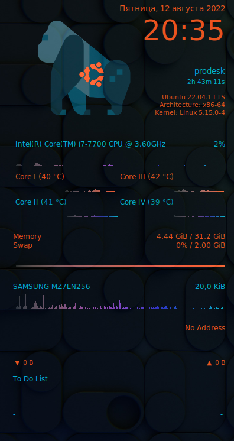

# VSCode extension for .conkyrc

> 💡 **Make sure syntax highlighting is enabled correctly.**  
> If the colors look off, click on the language mode in the bottom right corner of VS Code and ensure it is set to **Conky**.


## Preview



## Example Configuration

Here is a basic `.conkyrc` template to help you get started:

```conky
conky.config = {
    background = true,
    update_interval = 1.0,
    cpu_avg_samples = 2,
    net_avg_samples = 2,
    double_buffer = true,
    out_to_console = false,
    -- ... add your lua config here
}

conky.text = [[
color e95420{font :size=10}alignr{time %A, %d %B %Y}
color e95420{font :size=36}alignr{time %H:%M}
]]
```
